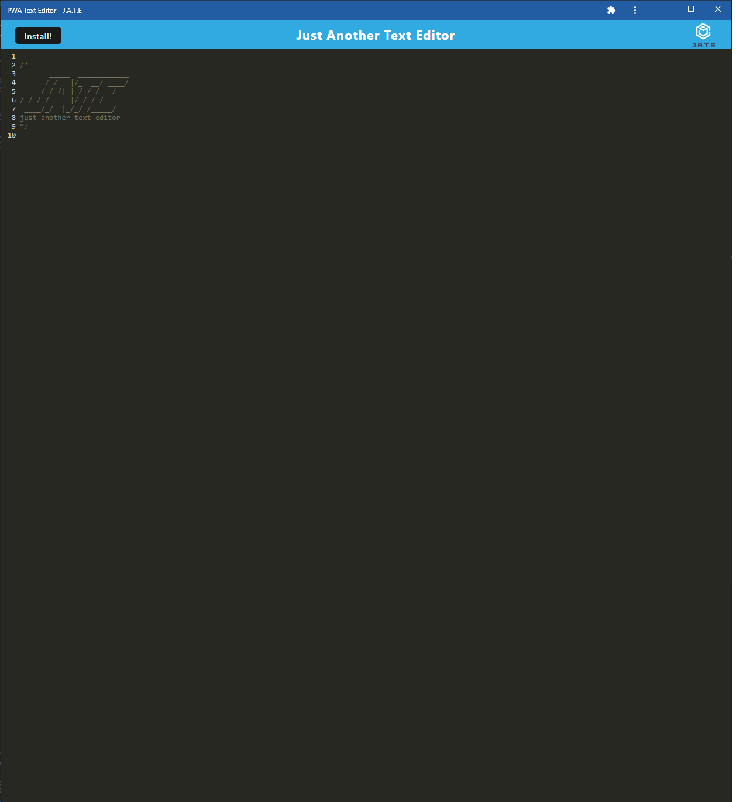
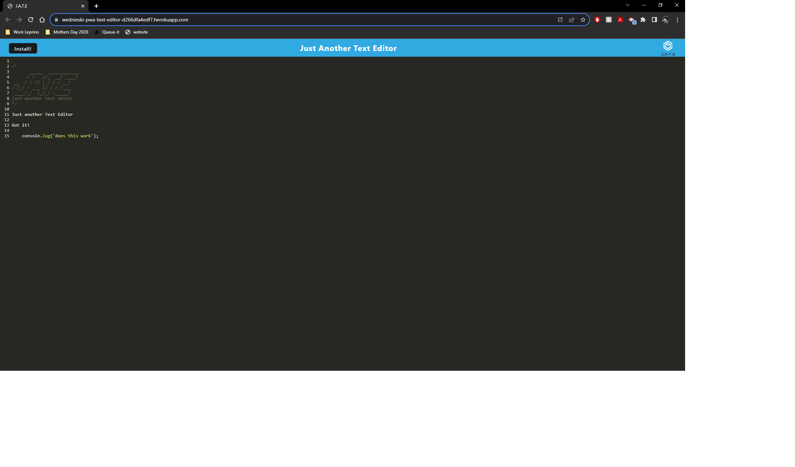

  # Text Editor
  
  ## Description 
  This Progressive Web Application (PWA) Text Editor allows developers to create and store notes or code snippets seamlessly, with or without an internet connection. The application provides a reliable solution for accessing and managing content, ensuring that data is readily available for future use.
  
  ## Table of Contents
  * [Technology Stack](#technology-stack)
  * [User Story](#user-story)
  * [Acceptance Criteria](#acceptance-criteria)
  * [Installation](#installation)
  * [Screenshot](#screenshot)
  * [Deployed Page](#deployed-page)
  * [License](#license)
  * [Questions](#questions)

  ## Technology Stack

  
  
  

  ## User Story
  ```md
    AS A developer
    I WANT to create notes or code snippets with or without an  
    internet connection
    SO THAT I can reliably retrieve them for later use
  ```

  ## Acceptance Criteria
  ```md
    GIVEN a text editor web application
    WHEN I open my application in my editor
    THEN I should see a client server folder structure
    WHEN I run `npm run start` from the root directory
    THEN I find that my application should start up the backend  
    and serve the client
    WHEN I run the text editor application from my terminal
    THEN I find that my JavaScript files have been bundled using  
    webpack
    WHEN I run my webpack plugins
    THEN I find that I have a generated HTML file, service worker,  
    and a manifest file
    WHEN I use next-gen JavaScript in my application
    THEN I find that the text editor still functions in the browser  
    without errors
    WHEN I open the text editor
    THEN I find that IndexedDB has immediately created a database  
    storage
    WHEN I enter content and subsequently click off of the DOM window
    THEN I find that the content in the text editor has been saved  
    with IndexedDB
    WHEN I reopen the text editor after closing it
    THEN I find that the content in the text editor has been retrieved  
    from our IndexedDB
    WHEN I click on the Install button
    THEN I download my web application as an icon on my desktop
    WHEN I load my web application
    THEN I should have a registered service worker using workbox
    WHEN I register a service worker
    THEN I should have my static assets pre cached upon loading along  
    with subsequent pages and static assets
    WHEN I deploy to Heroku
    THEN I should have proper build scripts for a webpack application
  ```
  
  ## Installation 
  
  * Ensure you are running Node.js v16.
  * Clone the repository.
  ```
    git clone git@github.com:iam3dski/PWA-text-editor.git
  ```

  * Install the dependencies.
  ```
    npm i
  ```

  * Start the server in the terminal.
  ```
    npm start 
  ```
  > Application available at localhost:3000

  ## Screenshot

  
  
  
  ## Deployed page

  [View Published Page](https://wednieski-pwa-text-editor-d266dfa4edf7.herokuapp.com/)


  ## License 
  [](https://lbesson.mit-license.org/)